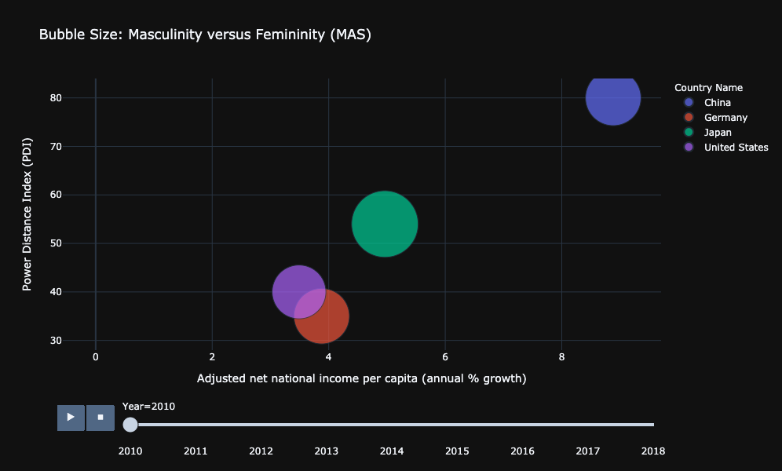
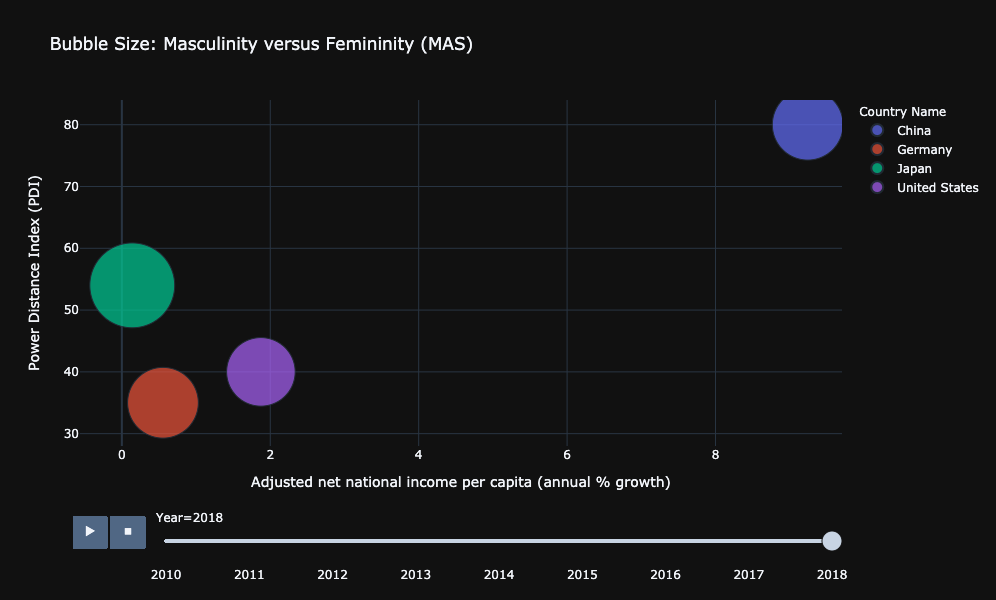
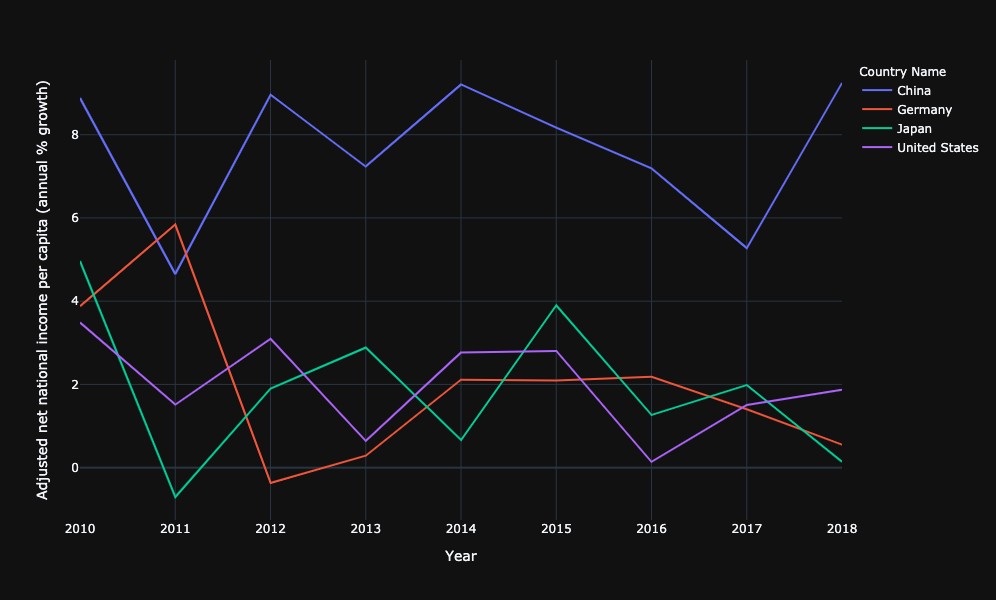
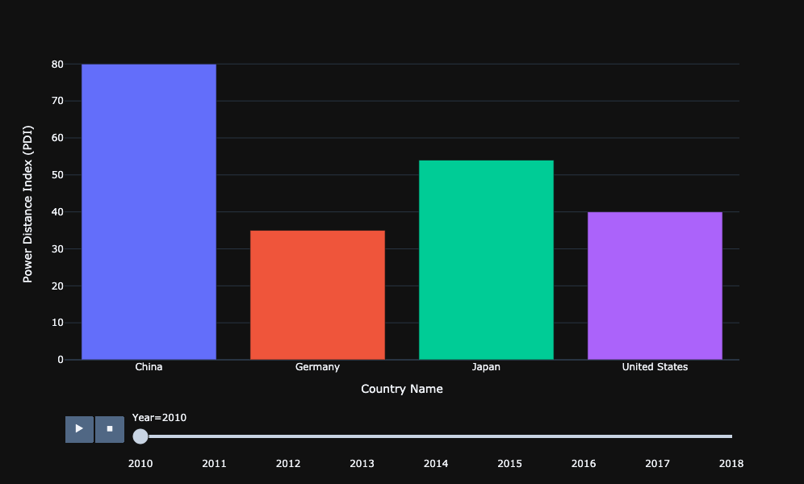
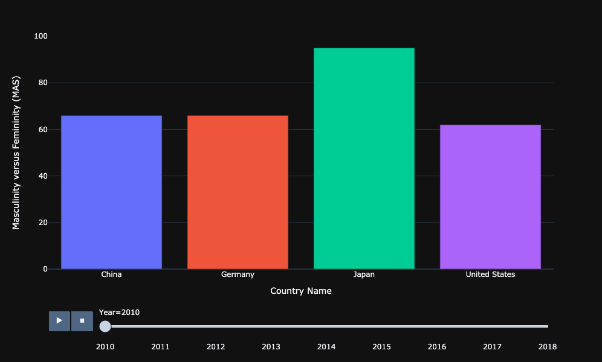
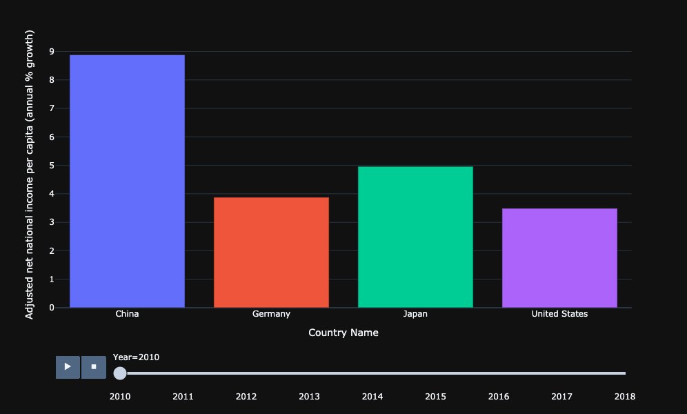
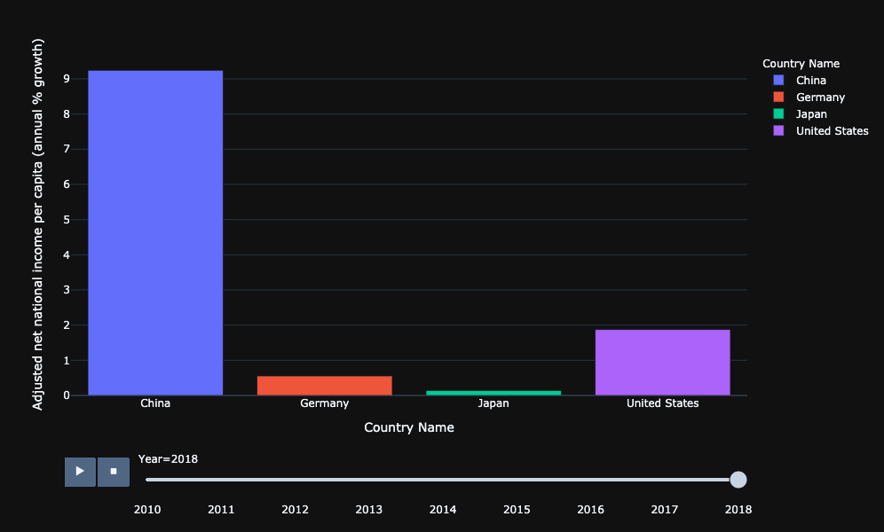

# Individual Project Part A

# Introduction:

## What is it that you are investigating/exploring/analyzing?

### I am exploring how a country's societal values relate to how much money an average citizen has. 
### To investigate this, I am using three indicators:

### Masculinity vs. femininity (MAS)
### This measures the preference of that country's society for masculine traits vs. feminine traits.  
### This can also refer to the distribution of roles between men and women.
### The higher this value, the more masculine the society is. 

### Power Distance index (PDI)
### This index measures the degree to which the less powerful members of society accept and expect that power is distributed unequally. 
### The higher the index, the higher this degree. 

### Adjusted net national income per capita (annual % growth)
### The country's adjusted net national income per citizen is taken as a percentage of growth per year.

### Furthermore, I am comparing these indicators across four of the world's richest countries:
### - United States
### - China
### - Japan
### - Germany

### For the time frame, it is 2010 to 2018

## Why is it important to you and/or to others?

### This study will let us find out how a country's culture impacts their economic success. 
### The position of this country of the world stage could very well be linked to their societal norms. 
### This relationship between culture and economic success also has a direct impact on individual citizens. 

## What questions do you have in mind and would like to answer?

### - Is there a relationship between the three indicators of these four countries? If so, then what kind of relationship is there?
### - How do these three indicators relate to each other?
### - Are there any historic trends?
### - Compare and contrast the indicators for different countries. What are the implications?

## Where do you get the data to help answer your questions?

### These websites list the most economically powerful countries. This allowed me to pick my four countries. 
### https://www.usnews.com/news/best-countries/power-rankings
### https://www.investopedia.com/insights/worlds-top-economies/

## What process/step you use to analyze the situation/issue

### I will use three charts:

### Bubble: to explore relations between different topics/indicators
### Line: to look at the historic trend to spot any changes
### Bar: to compare different countries and show similarities/differences and their implcations

# Analysis

## Using Bubble Charts:

## Is there a relationship between the three indicators of these four countries? If so, then what kind of relationship is there?

### Yes, there is a relationship. 
### Here is a bubble chart for 2010:
### 
### We can see that there is very clear positive linear relationship between power index and adjusted net national income per capita (annual % growth).
### As the annual % growth increases, so does the power distance index.
### Thus, the data suggests that as a country's annual % growth increases, so does their power index. 

## How do these three indicators relate to each other?

### Using bubble charts:
### The size of the bubble represents the ratio of masculinity to feminitiy values in that country. 
### However, the bubble size doesn't appear to have any trend, or correlation to the other two variables.
### Thus, the data suggests that this variable does not have a significant impact or relationship to a country's power index or annual % growth. 

### As time goes on, the trend becomes less defined:
### Here is a bubble chart for 2018:
### 
### However, we are still able to identify a linear trend, even though it is not as apparent as in 2010. 

## Using Line Charts:

## - Are there any historic trends?

### - The power index and masculinity vs. femninity have both remained constant values from 2010-2018
### - However, the annual % growth has dynamic changes:
### 

### We can see that for three of the countries (United States, Japan, and Germany) the fluctuations are in a relative level, that being in a 0-4% range.  
### What is interesting is China, whose growth rate is fluctuating at a level that is way above these other three other countries.
### What's more, from 2017 - 2018 it shows China's growth rate skyrocketing. 
### Meanwhile for the other three, Japan and Germany's growth rates are actually decreasing. The United States does show an increasing growth rate, but it's a very modest incline. 
### Thus, we need to consider China's huge growth rate as compared to the rest of the countries when we think about the other indicators. 

## Using Bar Charts:

## - Compare and contrast the indicators for different countries. What are the implications?

### Here is a bar chart of the power distance index and MAS for these four countries. There is no change from 2010-2018:
### 
### 

### Here is the bar chart of the annual % growth in 2010:
### 
### Compare this to 2018:
### 
### We see that in 2010, China's growth rate was significantly higher than the three other countries. 
### As of 2018, we can see that the gap between China's growth rate with that of the other countries has gotten even bigger. 

### Things To Think About:
### We must consider that China's larger growth rate is due to various other causes at play, of which may or may not be correlated with the MAS or PDI. 
### Regarding the PDI, there appears to be a small positive linear trend that can be found between the PDI and growth rate. 
### However, the MAS does not appear to have any significant correlation with either the growth rate or PDI. 
